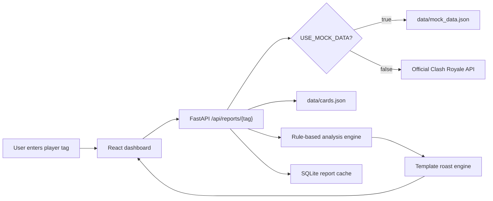

# Saville Fraud Royale Detector

A troll-style Clash Royale dashboard that analyses recent battle-log evidence, deck composition, matchup patterns, and card levels to produce playful fraud reports. It does not use a paid LLM API. Every diagnosis and roast is rule-based and template-driven.

## Features

- React + Vite + TypeScript frontend with Tailwind, Recharts, Framer Motion, and lucide icons
- FastAPI backend with a Clash Royale API service layer
- Mock demo mode with four demo victims and 25 generated battles per victim
- Rule-based deck personality, matchup trauma, level-blame, panic-switching, clutch, and divorce recommendations
- Evidence drawers under every major roast
- Goblin Mode toggle for stronger non-hateful roast templates
- Client-side share, copy, and SVG image download for the report summary
- SQLite report cache
- Unit tests for the core analysis functions

## Screenshot Placeholders

Add screenshots here after running the app locally:

- `docs/screenshots/landing.png`
- `docs/screenshots/report-dashboard.png`

## Architecture



## Setup

From the project root:

```powershell
cd C:\Users\hp\Documents\Codex\2026-06-30\re\saville-fraud-royale-detector
```

Create a `.env` file from the example:

```powershell
Copy-Item .env.example .env
```

Enable mock mode in `.env`:

```text
USE_MOCK_DATA=true
CLASH_ROYALE_API_KEY=
FRONTEND_ORIGIN=http://localhost:5173
```

## Backend

Install dependencies:

```powershell
cd backend
py -m pip install -r requirements.txt
```

Run the backend:

```powershell
py -m uvicorn app.main:app --reload --host 127.0.0.1 --port 8000
```

Health check:

```powershell
Invoke-RestMethod -Uri http://127.0.0.1:8000/api/health
```

## Frontend

Install dependencies:

```powershell
cd frontend
npm.cmd install
```

Run the frontend:

```powershell
npm.cmd run dev
```

Open:

```text
http://localhost:5173
```

## Real Clash Royale API Mode

Get an API key from the official Clash Royale developer portal:

```text
https://developer.clashroyale.com/
```

Set:

```text
USE_MOCK_DATA=false
CLASH_ROYALE_API_KEY=your_backend_only_key
```

Then restart the backend. If `USE_MOCK_DATA=true`, only the built-in demo victims can load; real player tags will not call the Clash Royale API.

Never put the API key in the frontend. The frontend only calls the FastAPI backend.

The backend supports:

```text
GET /v1/players/%23{player_tag}
GET /v1/players/%23{player_tag}/battlelog
```

Player tags are normalized and URL-encoded by the backend service.

## Tests

Run backend tests:

```powershell
cd backend
py -m unittest discover tests
```

Build frontend:

```powershell
cd frontend
npm.cmd run build
```

## Limitations

The Clash Royale battle log does not provide replay footage, card placements, elixir spending, card timing, or card-cast counts. The app only analyses recent public battle-log data: decks, crowns, outcomes, opponent deck cards, player deck cards, and card levels when present.

Small samples are marked with lower confidence. The dashboard is for entertainment and evidence-based joking, not guaranteed meta coaching.

## Git Workflow

Suggested workflow:

```powershell
git init
git pull origin main
git add .
git commit -m "Build Saville Fraud Royale Detector dashboard"
git push origin main
```

If `git pull origin main` reports conflicts, inspect and resolve them before committing. Do not overwrite remote work blindly.
