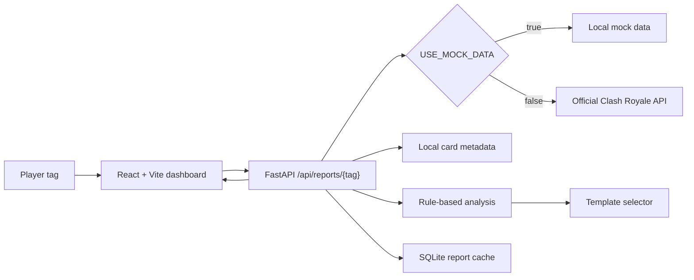

# Saville Fraud Royale Detector

A premium troll-style Clash Royale dashboard that turns recent battle-log evidence into an entertainment-grade fraud report. It analyzes deck shape, card levels, matchup patterns, close-game results, and panic switching, then produces a rule-based roast report with receipts.

No paid LLM API is used. All verdicts, descriptions, and jokes come from deterministic rules and local template catalogs.

## What It Shows

- Fraud Score: the main 0-100 verdict, built from evidence-backed contributors.
- Overall Personality Report: a playful deck-behavior summary with a clear scope note.
- Deck Personality: archetype estimate, plain-language deck explanation, and detected traits.
- Matchup Trauma: repeated opponent cards, recurring card cores, and sample-size confidence.
- Behaviour Patterns: deck switching after losses, main deck record, and deck similarity.
- Overlevelled Fraud Score: the percentage of level-known losses where the player had a meaningful average card-level advantage.
- Supporting Evidence: simplified charts for score contributors, loss types, most-used cards, and recent trend.
- Share/copy/download actions for the generated report.

## Data Modes

The app supports both mock and real Clash Royale data:

- `USE_MOCK_DATA=true`: uses local demo victims and generated battle logs.
- `USE_MOCK_DATA=false`: calls the official Clash Royale API from the FastAPI backend.

The frontend never receives the API key. Keep the key only in the project root `.env` file or another backend-only environment source. Do not commit `.env`.

## Official Card Icons

When real Clash Royale API responses include official `iconUrls.medium` or `iconUrls.evolutionMedium` values, the backend passes those URLs through as `icon_url` and the frontend displays them. If an icon URL is not present, the UI uses a clean initials fallback instead of copied or scraped card art.

## Architecture



## Setup

From the project root:

```powershell
cd C:\Users\hp\Documents\Codex\2026-06-30\re\saville-fraud-royale-detector
```

Install backend dependencies:

```powershell
cd backend
py -m pip install -r requirements.txt
```

Install frontend dependencies:

```powershell
cd ..\frontend
npm.cmd install
```

## Environment

Create `.env` from the example if needed:

```powershell
Copy-Item .env.example .env
```

Mock mode:

```text
USE_MOCK_DATA=true
CLASH_ROYALE_API_KEY=
FRONTEND_ORIGIN=http://localhost:5173
```

Real API mode:

```text
USE_MOCK_DATA=false
CLASH_ROYALE_API_KEY=your_backend_only_key
FRONTEND_ORIGIN=http://localhost:5173
```

Get a Clash Royale API key from the official developer portal:

```text
https://developer.clashroyale.com/
```

## Run Locally

Backend on the default port:

```powershell
cd backend
py -m uvicorn app.main:app --reload --host 127.0.0.1 --port 8000
```

If Windows blocks or reserves port `8000`, run the backend on another port, for example:

```powershell
py -m uvicorn app.main:app --reload --host 127.0.0.1 --port 8080
```

Then point the frontend at that backend:

```powershell
cd ..\frontend
$env:VITE_API_BASE_URL="http://127.0.0.1:8080"
npm.cmd run dev
```

Frontend on the default backend:

```powershell
cd frontend
npm.cmd run dev
```

Open:

```text
http://localhost:5173
```

Health check:

```powershell
Invoke-RestMethod -Uri http://127.0.0.1:8000/api/health
```

## API

Main local endpoints:

```text
GET /api/health
GET /api/demo-victims
GET /api/reports/{player_tag}?goblin_mode=false&seed=saville
```

The backend normalizes and URL-encodes player tags before calling:

```text
GET /v1/players/%23{player_tag}
GET /v1/players/%23{player_tag}/battlelog
```

## Tests And Build

Run backend tests:

```powershell
cd backend
py -m unittest discover tests
```

Build frontend:

```powershell
cd frontend
npm.cmd run build
```

The backend tests cover the scoring engine, deterministic template output, duplicate roast prevention, official icon URL pass-through, low-sample confidence, deck trait detection, and compatibility between the legacy `roast_report` fields and the newer report sections.

## Limits

The Clash Royale battle log does not include replay footage, card placements, elixir spending, timing, card-cast counts, or exact in-match decisions. The dashboard only uses recent public battle-log data: decks, crowns, results, opponent deck cards, player deck cards, and card levels when present.

The personality report is a joke summary of deck behavior, not a real psychological diagnosis. Small samples are deliberately marked with lower confidence.
